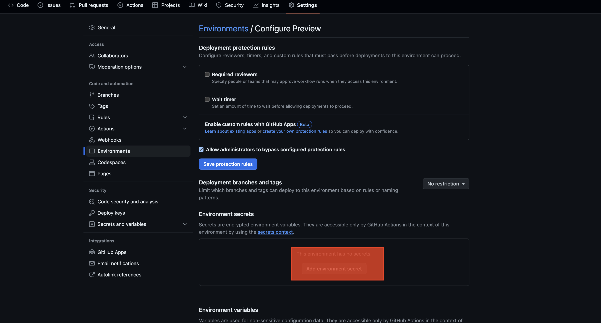

### 1. Création d'une Google Cloud Function via le Dashboard Google Cloud

#### A. Prérequis
- Un compte Google Cloud avec les permissions appropriées pour créer des fonctions.
- Avoir installé et configuré le SDK Google Cloud (`gcloud`).

#### B. Configuration du projet
1. **Connectez-vous à Google Cloud Console** : Accédez à [Google Cloud Console](https://console.cloud.google.com/) et sélectionnez ou créez un projet.
<br> </br>


<br></br>

2. **Activation des API** : Activez l'API Cloud Functions et l'API Cloud Build si elles ne sont pas déjà actives.
<br> </br>

<div>


</div>


#### C. Création de la fonction
1. **Accédez à Cloud Functions** : Dans le menu de navigation, allez à "Compute > Cloud Functions".
2. **Créez une nouvelle fonction** :
   - Cliquez sur "Create function".
   - Nommez votre fonction et choisissez une région (us-east-1 de préférence).
   - Choisissez "HTTPS" pour le type de déclencheur.
   - Saisissez votre code dans l'éditeur en ligne ou téléchargez votre fichier de code source.
   - Cliquez sur "Deploy" pour déployer la fonction.
<br> </br>

<div>


</div>

### 2. Automatisation du déploiement avec GitHub Actions

#### A. Prérequis
- Un dépôt GitHub contenant le code de votre projet Node.js.
- Les droits administratifs sur le dépôt pour configurer les secrets et les GitHub Actions.

#### B. Configuration des secrets de dépôt
1. **Configurer les secrets dans GitHub**:
   - Accédez à votre dépôt GitHub.
   - Allez à "Settings > Secrets" et ajoutez les secrets suivants:
     - `gcp_project`: Votre ID de projet Google Cloud.
     - `gcp_credentials`: Base64 de la clé JSON de votre compte de service Google Cloud.
<br> </br>

<div>




</div>

#### C. Création du workflow GitHub Actions
1. **Créez un fichier de workflow** :
   - Dans votre dépôt GitHub, créez un dossier `.github/workflows`.
   - Créez un fichier YAML, par exemple `build.yml`.
2. **Écrivez le workflow** :
   ```yaml
   name: Deploy Cloud Function

    on:
      push:
        branches:
          - main
    jobs:
      deploy:
        name: Deploy to Google Cloud Functions
        runs-on: ubuntu-latest

        steps:
          - name: Checkout code
            uses: actions/checkout@v2
    
          - name: Set up Cloud SDK
            uses: google-github-actions/setup-gcloud@v0.2.0
            with:
              version: 'latest'
              project_id: ${{ secrets.gcp_project }}
              service_account_key: ${{ secrets.gcp_credentials }}
              export_default_credentials: true
    
          - name: Deploy Function
            run: |
              gcloud functions deploy YOUR_CLOUD_FUNCTION_NAME \
                --entry-point YOUR_ENTRY_POINT \
                --runtime YOUR_NODE_VERSION \
                --region=YOUR_REGION \
                --source=. \
                --trigger-http \
                --allow-unauthenticated
    
          - name: Install Dependencies
            run: npm install
   ```
   - Modifiez les informations selon votre Google Cloud Function


#### D. Sécurité et Authentification avec un BearToken
1. **Créez un BearToken** :
   - Ouvrez Postman et créez une nouvelle requête POST.
   - Ajoutez l'URL de votre Google Cloud Function.
   - Ajoutez un en-tête `Authorization` avec la valeur `Bearer YOUR_BEAR_TOKEN`.
   - Envoyez la requête pour tester l'authentification.

#### E. Code Covering
1. **Créez un compte Codecov** :
    - Accédez à [codecov](https://about.codecov.io/) et créez un compte.
    - Obtenez votre clé API à partir du tableau de bord.
    <br> </br>
    <div>
      
      
      
    </div>
    <br> </br>
    - Ajoutez la clé API à vos secrets GitHub. (Même procédure que pour les secrets Google Cloud)
    
2. **Ajoutez le workflow Codecov** :
    ```yaml
    codecove:
    name: Codecov
    runs-on: ubuntu-latest
    steps:
      - uses: actions/checkout@v3
      - name: Set up Node.js
        uses: actions/setup-node@v3
        with:
          node-version: '21'
      - name: Install Dependencies
        run: npm install
      - name: Display Coverage Data
        run: cat ./coverage/lcov.info
      - name: Upload Coverage to Codecov
        uses: codecov/codecov-action@v3
        with:
          token: ${{ secrets.CODECOV_TOKEN }}
          files: ./coverage/lcov.info
          fail_ci_if_error: true
    ```

#### F. Mock

#### G. Stress Test & Latency Lingo déploiement
1. **Instalation de JMeter** :
    - Téléchargez et installez JMeter à partir du site officiel.
    ```bash
      Mac os: brew install jmeter
    ```
    - Ouvrez JMeter et créez un nouveau plan de test.
    ```bash
      jmeter
    ```
    <br> </br>
    - Cree un nouveau plan de test, ajoutez un échantillon HTTP et le HTTP Header Manager.
    <br> </br>
    <div>
      
      
      
    </div>
    <br> </br>

    - Ajouter les retour de la requête.
    <br> </br>
    <div>
      
      
      
    </div>
    <br> </br>
    - Configurez la requete http pour pointer vert notre api.
    <br> </br>
    <div>
      
    </div>
    <br> </br>

    - Configurez le header afin de valider l’authentification.
    <br> </br>
    <div>
      
    </div>
    <br> </br>

    - Exécutez le plan de test pour simuler le trafic et mesurer les performances.
    <br> </br>
    <div>
      
    </div>
    <br> </br>

2. **Créez un compte Latency Lingo** :
    - Accédez à [Latency Lingo](https://latencylingo.com/) et créez un compte.
    <br> </br>

    <div>
      
    </div>
      
    - Obtenez votre clé API à partir du tableau de bord.
    <br> </br>

    <div>
      
      
      
    </div>

3. **Ajouter le workflow** :
   ```yaml
      JMeter: 
        name: Create JMeter Test Plan & Deploy to Latency Lingo
        runs-on: ubuntu-latest
        
        steps:
          - uses: actions/checkout@v3
          - name: Run JMeter Tests
            uses: QAInsights/PerfAction@v3.1
            with:
              test-plan-path: ./JMeter/ApiTestPlan.jmx
              args: ""
          - name: Upload Results
            uses: actions/upload-artifact@v2
            with:
              name: jmeter-results
              path: result.jtl
          - name: Analyze Results with Latency Lingo
            uses: latency-lingo/github-action@v0.0.2
            with:
              api-key: ${{ secrets.LATENCY_LINGO_API_KEY }}
              file: result.jtl
              label: Checkout Flow Automated Test Plan
              format: jmeter
   ```


